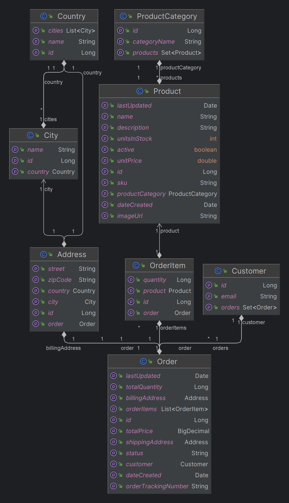

# Full Stack Ecommerce Project

This repository contains the code for a full-stack ecommerce website, built with Angular and Spring Boot. The website offers a wide range of features, including form validation, a shopping cart, Okta integration for authentication, order history, and more.

## Table of Contents

- [Features](#features)
- [Technologies Used](#technologies-used)
- [Getting Started](#getting-started)
- [Class Diagram](#class-diagram)
- [Okta Account Setup](#okta-account-setup)
- [Contribution](#contribution)

## Features

- Form validation.
- Shopping cart functionality to add, remove, and manage selected items.
- Okta integration for secure user authentication and authorization.
- Order history to track past orders.

## Technologies Used

The main technologies used in this project are:

- Angular 16.1.0
- Spring Boot 3.1.1
- MySQL 8

## Getting Started

This project includes a Docker Compose configuration for easy deployment. To run the application using Docker Compose, make sure you have Docker installed on your system and then follow these steps:

1. Navigate to the root directory.
1. Build the Docker images: `docker-compose build`. This might take a while depending on your internet speed.
1. Launch the application: `docker-compose up`. This will start the frontend, backend, and MySQL database in separate containers and make the app accessible at `http://localhost:80`.
1. For testing purposes, a user account has been created with the following credentials:

   - Username: user@ecommerce.com
   - Password: usr@ecom

## Class Diagram
The class diagram illustrates the key classes and their relationships.



## Okta account Setup
In the Angular codebase, the Okta account configuration can be found in ``src/environments/environment.prod.ts`` file. The current settings are:
```export const environment = {
  oidc: {
    clientId: '0oaaeeost9XRbo0JD5d7',
    issuer: 'https://dev-08064476.okta.com/oauth2/default',
    redirectUri: `${window.location.origin}/login/callback`,
    scopes: ['profile', 'email', 'openid'],
  },
  production: true,
  backendBaseUrl: 'http://localhost:8090/api/v1',
};
```
If you want to use your own Okta account, follow these steps:

1. Open ``src/environments/environment.prod.ts``  and update the clientId and issuer with your Okta account credentials. The values should correspond to your Okta application settings. Ensure to add necessary Origin URLs in your Okta account settings to securely redirect users to custom pages and enable cross-origin resource sharing.
2. In ``docker-compose.yml``, update the environment variable named `OAUTH_ISSUER` for the backend service.
3. Run ```docker-compose build ```
4. Run ```docker-compose up ```
## Contribution

Please fork the repository if you want to contribute to this project, then submit a pull request with your improvements. Any suggestions and comments are appreciated!

