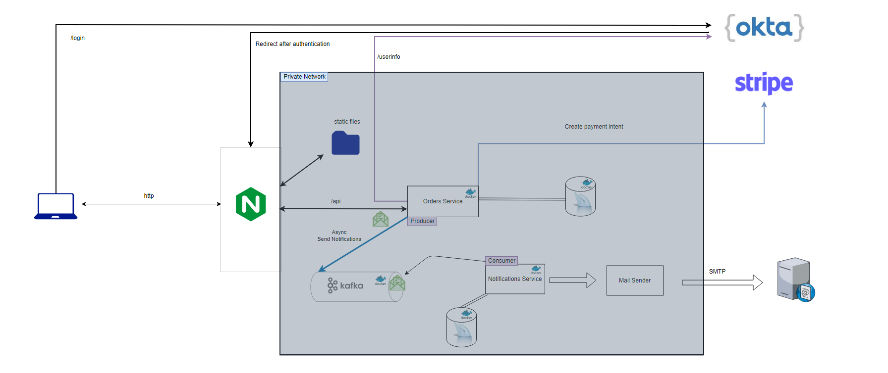

# Full Stack Ecommerce Project

## Table of Contents

- [Features](#features)
- [Tech Stack](#tech-stack)
- [Demo](#demo)
- [Architecture Diagram](#architecture-diagram)
- [Okta Account Setup](#okta-account-setup)
- [Stripe Integration](#stripe-integration)
- [Customer Notifications](#customer-notifications)
- [Contribution](#contribution)

## Features

- Form validation.
- Shopping cart functionality to add, remove, and manage selected items.
- Okta integration for secure user authentication and authorization.
- Order history to track past orders.
- Payment processing with Stripe.
- Producing order events with Kafka.
- Consuming order events and sending notifications to customers.

## Tech Stack

The main technologies used in this project are:

- Angular 16.1.0
- Spring Boot 3.1.1
- Node.js 18
- MySQL 8
- Stripe
- Kafka
- Okta
- Docker
- Nginx

## Demo

https://github.com/abdulazezms/ecommerce-spring-angular-oauth/assets/75917617/ba456ebc-4e20-4978-9530-868cce2a918e

## Architecture Diagram

## Stripe Integration

This project integrates with Stripe for payment processing. To use this feature, you need to set up your Stripe account and configure the necessary credentials in your application.
1. In [docker compose](docker-compose.yml), add your stripe secret key to the orders-service's STRIPE_SECRET_API_KEY environment variable.
1. In [angular's environment variables](angular/src/environments/environment.prod.ts), add your stripe publishable key to the stripePublishableKey environment variable.
1. From the root directory, build the images: `docker-compose build`.

## Okta account Setup

You must use your Okta account in order to support authentication which almost all other features depend on.

1. in [angular's environment variables](angular/src/environments/environment.prod.ts), update the clientId and issuer with your Okta account credentials. Ensure to add necessary origins in your account settings to securely redirect users to custom pages and enable cross-origin resource sharing. This was done in Okta application settings by adding http://localhost origin, since Okta must redirect the user after authentication to this origin, where nginx is serving requests.
2. In [docker compose](docker-compose.yml), add Okta issuer URL to the environment variable named `OAUTH_ISSUER` in the orders-service. This is because the orders-service has to authenticate that the user is who he claims and can fetch more information about the user, if needed.
1. From the root directory, build the images: `docker-compose build`.

## Customer notifications
Support for sending notifications to customers has been added to this project in the notifications service. To enable this feature, follow the step(s) below:
1. In [docker compose](docker-compose.yml), add your mail host username and password (aka app password) to the notifications-service environment variables.

Note, the configuration is tied to Gmail services. If you want to use an email service other than Gmail, then add the MAIL_HOST (e.g., smtp.gmail.com) and MAIL_PORT (e.g., 587) environment variables to the notifications-service

## Contribution

Please fork the repository if you want to contribute to this project, then submit a pull request with your improvements. Any suggestions and comments are appreciated!

